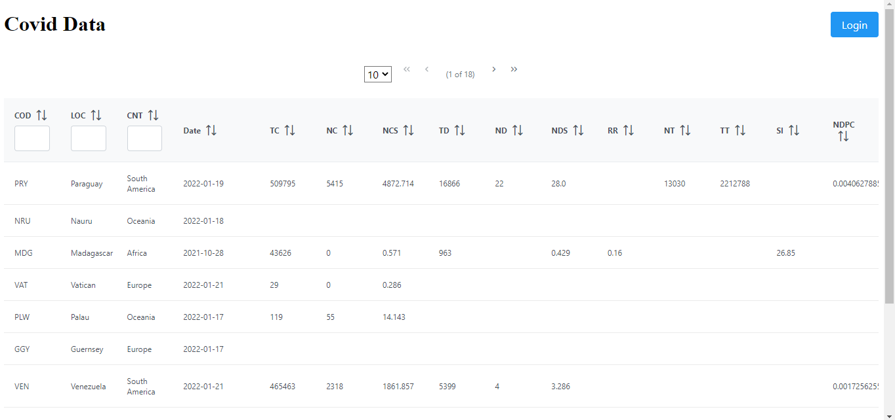
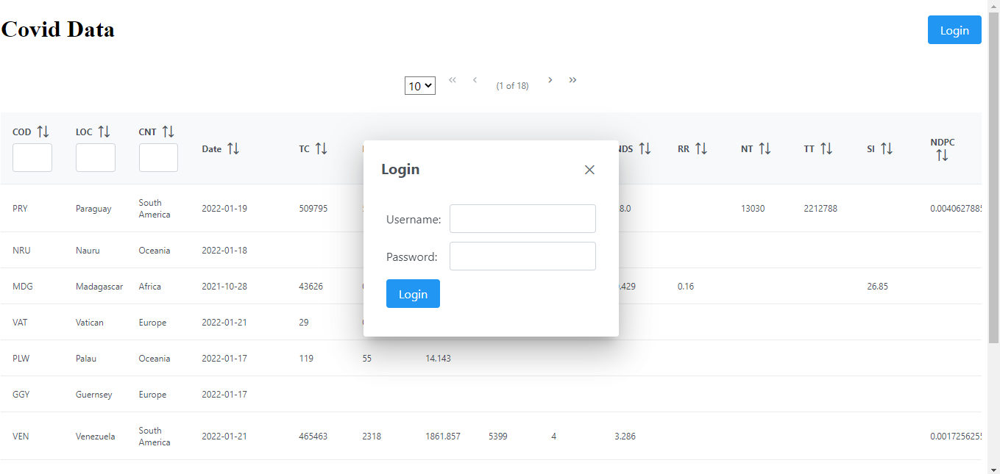
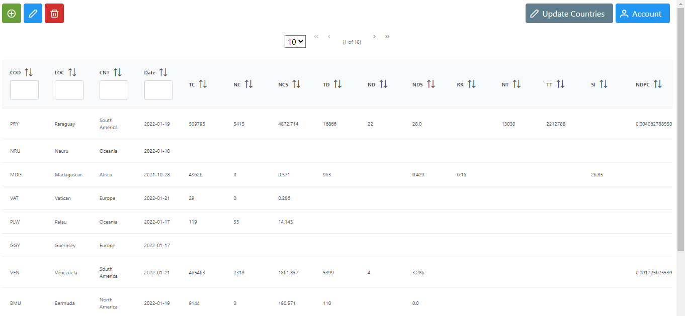
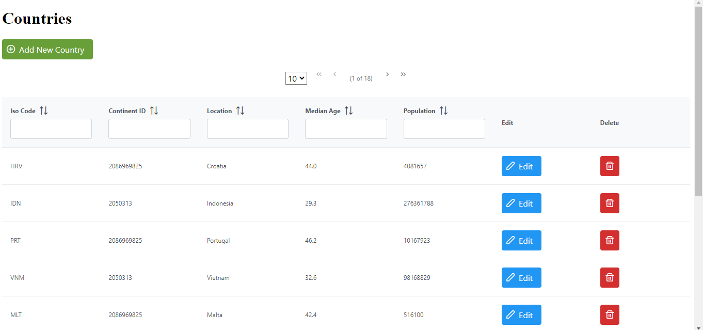
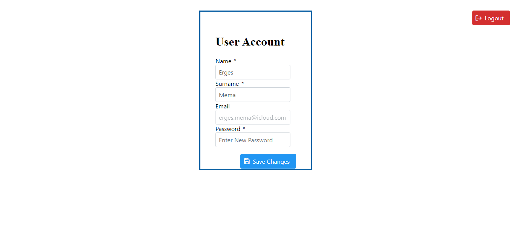

# Covid Data Web Application and SOAP API

The implementation of an API and web application for reading, displaying, filtering, and editing Covid data taken from the repository maintained by Mathieu, Ritchie, Ortiz-Ospina et al. (Mathieu et al, 2021). The project follows a Model-View-Controller (MVC) implementation under Jakarta Server Faces (JSF) framework.  
Find project report [here](https://drive.google.com/file/d/11g_pO8jAKlMfL8W7byl-GIBVfo7C8aDR/view?usp=sharing)

## Getting Started

### Dependencies

Java SE 8 or newer (usage of lambdas).
JSF 2.2
Primefaces 10.0.0
Java EE Version 7 Web
Glassfish 4.1.2

### Executing program

For development purposes and testing the Apache Netbeans IDE was used.

### Screenshots 

## Authors

Contributors names:

Erges Mema  

## Version History

* 0.1
    * Initial Release

## Acknowledgments

Covid Dataset From:

Mathieu, E., Ritchie, H., Ortiz-Ospina, E. et al. A global database of COVID-19 vaccinations. Nat Hum Behav (2021). https://doi.org/10.1038/s41562-021-01122-8

Also refer to [Covid Data Processor](https://github.com/ergesmema/Covid-Data-Processor)
